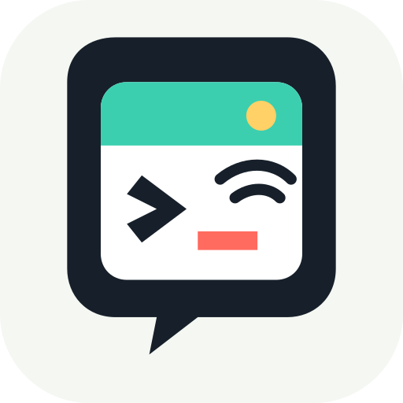
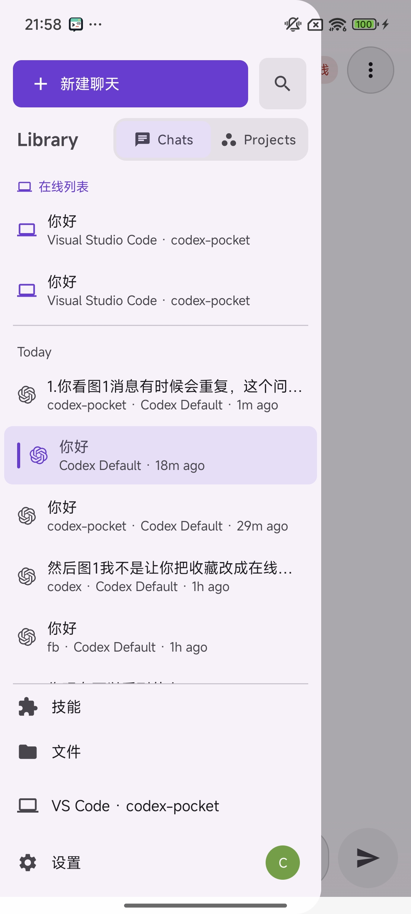
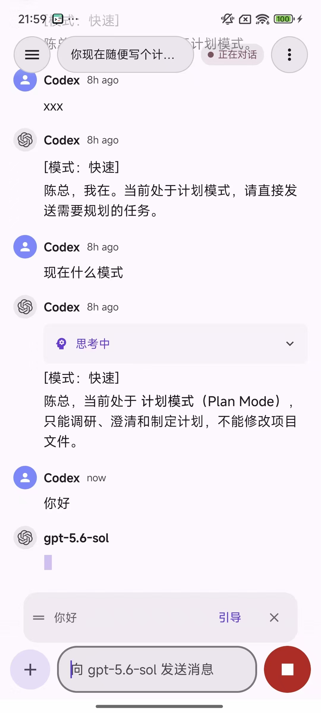
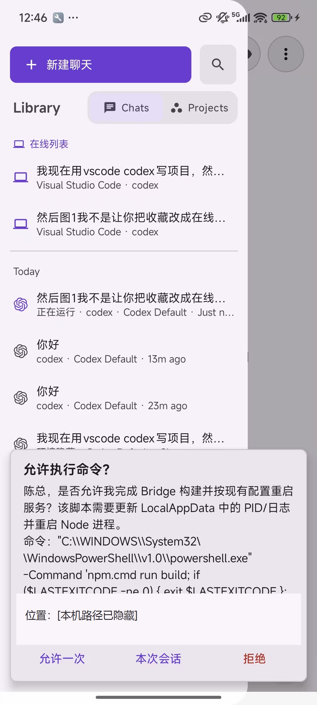
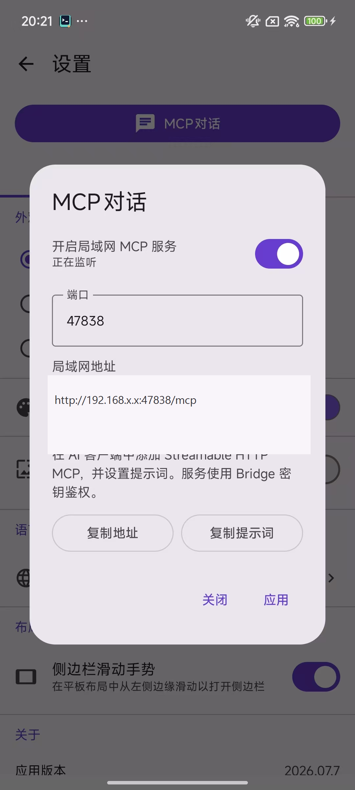
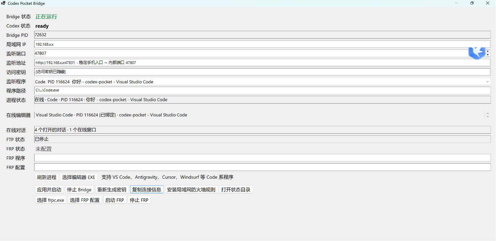

# Codex Pocket

<p align="center">
  
</p>

<p align="center"><strong>把电脑上的 Codex 会话装进口袋，离开工位也能继续查看、发送、审批和控制任务。</strong></p>

<p align="center">
  <a href="LICENSE"></a>
  
  
</p>

Codex Pocket 是一套开源的 Codex 移动伴侣，由 **Android 客户端、Windows Bridge 和编辑器 Companion** 组成。它把电脑上正在运行的 Codex 会话安全地连接到手机，让你不用一直守在电脑前，也能看到任务进度、继续发送要求、处理审批、管理排队消息，并在需要时停止由手机发起的任务。

它不是另一个聊天壳，也不会把你的工作区托管到第三方中转服务器。Bridge 运行在你自己的 Windows 电脑上，手机通过局域网连接；会话状态、工作区和编辑器窗口仍由本机环境管理。

> 本项目是社区维护的非官方项目，与 OpenAI、Microsoft、Anysphere、Google 或 LibreChat 官方无隶属关系。Codex、VS Code、Cursor、Antigravity、Windsurf 和 LibreChat 是其各自所有者的商标。

## 为什么实用

- **任务跑很久，不必守着电脑**：在手机上查看 Codex 的思考、回复和工具调用，随时掌握执行进度。
- **临时想到补充要求，可以马上发送**：任务执行中可把消息加入队列，也可将队列消息转为当前回合的引导消息。
- **审批不再卡住工作流**：命令、文件修改、权限申请和计划确认可以直接在手机上处理。
- **多窗口不会认错会话**：按编辑器实例和会话标识在线窗口，同一会话在不同窗口打开时也能区分。
- **手机和电脑状态保持一致**：发送、停止、运行中、排队和完成状态由 Bridge 统一同步，APP 重启后可重新恢复。
- **AI 可以主动向手机提问**：通过 MCP 展示 Markdown、图片、选择项或自由文本输入，适合需要人工确认的自动化流程。

## 适合谁

- 经常让 Codex 执行编译、重构、检索或其他长时间任务的开发者。
- 同时使用 VS Code、Cursor、Antigravity、Windsurf 等多个 Code 系编辑器的人。
- 希望在局域网内自主管理连接、密钥和数据路径，不依赖公共聊天中转服务的人。
- 需要让 AI 在执行过程中把图片、选项和确认请求发送到手机的人。

## 界面预览

### Android APP

<table>
  <tr>
    <th width="50%">在线会话</th>
    <th width="50%">实时对话与消息控制</th>
  </tr>
  <tr>
    <td align="center" valign="top">
      
    </td>
    <td align="center" valign="top">
      
    </td>
  </tr>
  <tr>
    <th>移动审批</th>
    <th>MCP 手机交互</th>
  </tr>
  <tr>
    <td align="center" valign="top">
      
    </td>
    <td align="center" valign="top">
      
    </td>
  </tr>
</table>

### Windows 服务端

<table>
  <tr>
    <th>Codex Pocket Bridge 控制器</th>
  </tr>
  <tr>
    <td align="center">
      
    </td>
  </tr>
</table>

需要上传的图片如下：

| 类型 | 文件名 | 应该截取的页面和内容 |
| --- | --- | --- |
| APP | `online-sessions.png` | 打开侧边栏的“在线列表”，画面中要能看到编辑器名称、会话名称和工作区 |
| APP | `chat-control.png` | 一个正在运行的对话，画面中要有消息时间线、输入框、发送/停止按钮以及队列或引导操作 |
| APP | `approval.png` | 对话中的计划确认、命令审批或权限审批卡片，并显示可操作按钮 |
| APP | `mcp-dialog.png` | MCP 请求在手机上的实际效果，包含 Markdown、图片、选择项或文本输入中的一种或多种 |
| 服务端 | `server-console.png` | 完整的 `Codex Pocket Bridge` 窗口，展示 Bridge/Codex/FRP 状态、监听地址、在线编辑器和操作按钮 |

图片会直接显示在本页。维护者只需按 [截图上传说明](docs/screenshots/README.md) 将对应文件上传到 `docs/screenshots/`，不需要再修改 README。上传前必须遮挡访问密钥、IP、用户名、本机路径和私人会话内容。

## 核心功能

| 功能 | 实际用途 |
| --- | --- |
| 在线会话 | 查看当前在哪个编辑器、窗口和工作区中打开的 Codex 会话 |
| 实时对话 | 按原始顺序显示思考、回复、工具调用、文件修改和最终结果 |
| 动态发送/停止 | 输入框有内容时显示发送按钮，清空后恢复为停止按钮 |
| 消息队列 | 当前任务运行时继续提交要求，Bridge 按顺序执行，不丢消息 |
| 消息引导 | 将队列中的要求追加到 Pocket 当前正在运行的回合 |
| 精确停止 | 只停止 Pocket 发起且回合标识匹配的任务，避免误停桌面独立任务 |
| 移动审批 | 在手机端允许一次、会话内允许或拒绝命令和权限请求 |
| 工作区文件 | 浏览当前绑定电脑的工作区文件，并将文件引用加入对话 |
| MCP 对话 | 向手机发送 Markdown、图片、选项和自由文本交互 |
| 对话提示词 | 为每个会话保存独立的 `developer_instructions` |
| Windows 控制器 | 管理 Bridge、连接密钥、防火墙、编辑器进程、FTP 和 FRP 状态 |

## 工作原理

```text
Android APP
    |  HTTP / SSE / Bearer Token
    v
Windows Bridge -------- MCP 客户端
    |                       |
    | Codex App Server      +-- Markdown / 图片 / 选项 / 文本请求
    |
Editor Companion
    |
    +-- VS Code / Cursor / Antigravity / Windsurf
```

1. **Editor Companion** 上报当前编辑器窗口、工作区和正在运行的会话。
2. **Windows Bridge** 连接 Codex App Server，统一管理事件流、审批、队列、引导和访问密钥。
3. **Android APP** 只连接你的 Bridge，并通过 Bearer Token 鉴权。
4. Bridge 是运行状态的权威来源，因此旧事件不会覆盖新回合，手机重连后也能恢复正确状态。

## 快速开始

### 环境要求

- Windows 10/11 x64
- Android 手机，手机和电脑位于同一个可信局域网
- Node.js 22 或更高版本
- .NET 10 SDK
- JDK 21 和 Android SDK
- 已安装并可正常使用 Codex 的 VS Code 或兼容编辑器

所有示例命令均在仓库根目录使用 Windows PowerShell 执行。

### 1. 获取源码和安装依赖

```powershell
git clone https://github.com/LeoChen-CoreMind/codex-pocket.git
Set-Location .\codex-pocket\bridge
npm.cmd ci
```

### 2. 安装 Editor Companion

```powershell
Set-Location ..\vscode-companion
.\install.ps1
```

安装脚本会为已存在的 VS Code、Cursor 和 Antigravity 扩展目录创建开发用目录联接。完成后重新加载每个编辑器窗口一次。打开 Codex 会话后，控制器和 APP 才能识别对应的在线窗口。

### 3. 构建 Windows Bridge 控制器

```powershell
Set-Location ..\bridge-control
.\build-static.ps1
```

产物位于：

```text
bridge-control/publish-static/CodexPocketBridge.exe
```

该程序已经内嵌 Node.js 和 Bridge bundle，运行时不需要单独打开终端。配置、密钥和运行状态保存在 `%LOCALAPPDATA%\CodexMobileBridge`，不会写进源码目录。

### 4. 构建并安装 Android APP

```powershell
Set-Location ..\mobile
.\gradlew.bat :app:assembleDebug
adb install -r .\app\build\outputs\apk\debug\app-debug.apk
```

调试 APK 使用 Android 标准调试签名。正式分发时，请通过 `keystore.properties` 或 `SIGNING_*` 环境变量配置自己的发布证书，严禁提交证书和密码。

### 5. 启动 Bridge

1. 先启动 VS Code、Cursor、Antigravity 或 Windsurf，并打开一个 Codex 会话。
2. 运行 `CodexPocketBridge.exe`，点击“刷新进程”。
3. 在“监听程序”中选择要绑定的编辑器；未自动识别时点击“选择编辑器 EXE”。
4. 首次使用可点击“安装局域网防火墙规则”，只开放项目所需端口。
5. 点击“应用并启动”，等待“Bridge 状态”显示为在线。
6. 点击“复制连接信息”。控制器会复制正确的局域网地址和访问密钥，不要手动填写 `127.0.0.1` 或猜测网卡地址。

手机稳定入口使用端口 `47831`。即使控制器内部监听端口调整，复制出来的连接信息仍应作为手机端的准确信息来源。

### 6. 连接手机

1. 打开 APP，在“连接到 Codex Pocket”页面粘贴控制器复制的地址，例如 `http://192.168.1.20:47831`。
2. 点击连接后进入密钥页面，粘贴“访问密钥”并确认。
3. 进入会话列表后，侧边栏“在线列表”会显示 Companion 已识别的编辑器窗口。
4. 打开会话即可查看实时输出、继续发送消息、处理审批或停止 Pocket 发起的任务。

地址和密钥必须来自同一台正在运行的 Bridge。重新生成密钥后，手机端需要使用新密钥重新连接。

## 使用方法

完成首次安装和连接后，日常使用按下面的顺序操作。

### 1. 启动电脑端

1. 打开需要工作的 VS Code、Cursor、Antigravity 或 Windsurf 窗口。
2. 在编辑器中打开工作区和 Codex 会话。
3. 运行 `CodexPocketBridge.exe`。
4. 确认控制器中的“Bridge 状态”和“Codex 状态”正常；如果更换了编辑器进程，点击“刷新进程”，重新选择后点击“应用并启动”。

Bridge 启动成功后可以让控制器保持运行。关闭 Bridge 后，APP 将无法继续同步电脑上的会话。

### 2. 在 APP 中选择会话

1. 打开 Codex Pocket，APP 会使用已保存的地址和密钥自动连接。
2. 打开侧边栏，在“在线列表”中找到当前编辑器和工作区。
3. 点击会话进入聊天页。在线条目会显示编辑器、工作区和运行状态，避免在多个窗口之间选错任务。

普通历史会话可以查看，但只有 Companion 当前上报为在线的编辑器窗口才能获得完整的窗口绑定和实时控制能力。

### 3. 发送新任务

1. 在输入框中填写要求，也可以从工作区文件中选择文件并引用到消息。
2. 输入框有内容时，右侧按钮自动变为“发送”。
3. 点击发送后，APP 会创建 Pocket 所有的 Codex 回合，并实时显示思考、回复、工具调用和文件修改。

### 4. 在任务运行中追加要求

- 直接发送的新消息会先进入队列，等待当前回合结束后执行。
- 如果补充内容必须立刻影响当前任务，在队列项上点击“引导”。
- 引导成功后，消息会通过 `turn/steer` 加入当前回合；如果回合已经变化，消息会继续安全地留在队列中。
- 队列项可以修改、取消或调整顺序，适合连续安排多个任务。

### 5. 停止当前任务

1. 清空输入框，右侧按钮会从“发送”恢复为“停止”。
2. 点击停止后，APP 会校验当前回合标识。
3. 只有 Pocket 发起的匹配回合会被停止，桌面端独立启动的任务不会被误停。

### 6. 处理审批和计划确认

当 Codex 请求执行命令、修改文件、获取权限或确认计划时，审批内容会显示在对话时间线中。根据需要选择允许一次、会话内允许、拒绝或计划确认，结果会立即返回电脑端的当前任务。

### 7. 使用 MCP 向手机提问

1. 进入 APP 设置中的“**MCP 对话**”，打开服务。
2. 把页面生成的 MCP 地址、Bearer Token 和提示词配置到 AI 客户端。
3. AI 调用 MCP 工具后，APP 会收到交互请求。
4. 在手机上查看 Markdown 或图片，完成选择或输入文字并提交。
5. 提交结果会返回原 MCP 调用，AI 随后继续执行任务。

### 8. 通过 FRP 远程使用

手机和电脑不在同一个局域网时，可以用 FRP 把电脑上的对应端口映射到一台公网服务器。

APP 连接 Bridge 时，只需要映射稳定手机入口：

```text
本机 127.0.0.1:47831  ->  FRP 服务器公网端口
```

现代版 `frpc.toml` 示例：

```toml
serverAddr = "你的 FRP 服务器域名或 IP"
serverPort = 7000

auth.method = "token"
auth.token = "你的 FRP 鉴权 Token"

[[proxies]]
name = "codex-pocket-bridge"
type = "tcp"
localIP = "127.0.0.1"
localPort = 47831
remotePort = 47831
```

`remotePort` 可以换成 FRP 服务端允许的其他端口。映射成功后，在 APP 中填写公网地址，例如：

```text
http://你的 FRP 服务器域名或 IP:47831
```

Windows 控制器已经提供 FRP 进程管理：

1. 点击“选择 `frpc.exe`”，选择本机 FRP 客户端。
2. 点击“选择 FRP 配置”，选择准备好的 `frpc.toml` 或 `frpc.ini`。
3. 先确保 Bridge 状态在线，再点击“启动 FRP”。
4. “FRP 状态”显示运行中后，使用公网地址和原 Bridge 访问密钥连接 APP。

如果还要从外网使用 MCP 对话，需要在同一份 FRP 配置中再映射 APP“**MCP 对话**”页面设置的端口。例如 MCP 使用 `47832`：

```toml
[[proxies]]
name = "codex-pocket-mcp"
type = "tcp"
localIP = "127.0.0.1"
localPort = 47832
remotePort = 47832
```

Bridge 和 MCP 是两个独立服务：只远程使用 APP 时映射 `47831` 即可；需要远程调用 MCP 时，再额外映射 MCP 实际使用的端口。

FRP TCP 映射本身不等于 HTTPS。公网使用时必须保留 Bridge/MCP Token 鉴权，并建议在 FRP 服务端增加 TLS、HTTPS 反向代理、访问白名单或 VPN，避免访问密钥和会话内容在不可信网络中明文传输。

### 9. 结束使用

只想暂时离开时可直接关闭 APP，电脑端 Codex 不会因此停止。需要完全断开服务时，在 Windows 控制器中点击“停止 Bridge”。不要在 Bridge 仍对外提供服务时公开连接地址和访问密钥。

## 消息队列和引导

当 Codex 正在运行时，Codex Pocket 会区分两种追加方式：

- **排队**：消息等待当前回合结束后，作为下一个回合自动发送。适合独立的新要求。
- **引导**：消息通过 `turn/steer` 加入当前回合。适合补充限制、纠正方向或追加当前任务所需的信息。

只有由 Pocket 发起且仍在运行的回合可以被引导或停止。桌面端独立发起的回合会同步状态，但手机不会冒险操作错误的任务。

输入框会根据内容自动切换按钮：有文字时显示发送，清空后显示停止。这样运行中的任务既能追加消息，也能快速暂停。

## MCP 手机交互

MCP 对话让支持 Model Context Protocol 的 AI 客户端主动向手机发起交互，适合“执行到关键步骤后等待用户确认”的自动化任务。

1. 在 APP 设置中进入“**MCP 对话**”。
2. 选择端口并开启服务。
3. 使用页面显示的第一个局域网地址；不要使用 `127.0.0.1`、虚拟网卡或 VPN 网卡地址。
4. 复制页面生成的 MCP 地址、Bearer Token 和提示词，配置到需要调用它的 MCP 客户端。
5. AI 发起请求后，手机可展示 Markdown、图片、单选/多选项或自由文本输入，并把结果返回给调用方。

MCP 地址和 Token 相当于访问凭据，不要发布到 issue、聊天记录或公开截图中。

## 常见问题

### 手机无法访问 Bridge

- 确认电脑和手机连接到同一局域网，且当前 Windows 网络类型为“专用网络”。
- 在控制器中重新点击“安装局域网防火墙规则”。
- 使用“复制连接信息”得到的地址，不要填写 `localhost` 或 `127.0.0.1`。
- 暂时断开 VPN、虚拟网卡或代理工具后重试，避免系统选错路由。
- 确认 `CodexPocketBridge.exe` 中 Bridge 状态为在线，并且手机访问的是端口 `47831`。

### APP 中没有在线会话

- 确认已经运行 `vscode-companion/install.ps1`。
- 安装后重新加载编辑器窗口。
- 确认编辑器中已经打开 Codex 会话，而不只是启动了编辑器。
- 在控制器中点击“刷新进程”，检查“在线编辑器”和“在线对话”。

### 地址正确但密钥无法通过

- 在控制器中点击“复制连接信息”，重新复制完整密钥。
- 如果点击过“重新生成密钥”，旧密钥会立即失效。
- 确认地址和密钥来自同一个 Bridge 实例。

### 消息只能排队，不能引导

- 引导只适用于 Pocket 发起的当前活动回合。
- 当前回合已结束、回合标识发生变化或任务由桌面独立发起时，消息会安全地保留在队列中。
- 刷新会话活动状态后再尝试，避免操作已经结束的旧回合。

### MCP 开启后仍无法访问

- 优先使用 APP 显示的第一个局域网 IPv4 地址。
- 确认端口未被其他程序占用，防火墙允许该端口。
- MCP 客户端必须携带页面生成的 Bearer Token。
- 不要把控制器 Bridge 地址误当成 MCP 地址，两者端口和路径可能不同。

### FRP 映射成功但 APP 无法连接

- APP 连接 Bridge 时确认 FRP 映射的是本机 TCP `47831`，不是只映射 MCP 端口。
- APP 地址中的端口必须填写 FRP 的 `remotePort`，不一定与本机 `localPort` 相同。
- 确认 FRP 服务端已放行对应公网端口，`frpc` 和 `frps` 日志中没有鉴权或端口占用错误。
- 确认 Bridge 先于 FRP 启动，并且 Windows 控制器中的“Bridge 状态”和“FRP 状态”均为运行中。
- 远程使用 MCP 时必须单独映射 MCP 页面配置的端口，映射 `47831` 不会自动转发 MCP 端口。

## 项目结构

| 目录 | 职责 | 技术 |
| --- | --- | --- |
| `mobile/` | Android 客户端、聊天、审批、设置和 MCP 界面 | Kotlin Multiplatform、Jetpack Compose、Ktor、Koin、Room |
| `bridge/` | Codex App Server 适配、API、SSE、队列、MCP 和工作区服务 | TypeScript、Node.js、Fastify、Zod、WebSocket |
| `bridge-control/` | Windows 图形控制器和自包含单文件发布 | C#、.NET、Windows Forms |
| `vscode-companion/` | 编辑器窗口、工作区、标签和运行状态同步 | JavaScript、VS Code Extension API |

## 安全边界

- Bridge 对非回环地址监听时强制要求 Bearer Token。
- Companion 只连接本机 Bridge，并按 `instanceId + threadId` 定向窗口命令。
- 工作区文件访问受当前绑定编辑器窗口的工作区路径限制。
- 审批采用先到响应生效，重复或过期响应会被拒绝。
- 手机不会对桌面独立发起的回合执行进程级强杀。
- FRP 远程访问必须继续使用高强度 Bridge/MCP Token，并建议叠加 TLS、访问白名单或 VPN。
- 本项目面向个人可信网络；未经 TLS、额外访问控制和审计，不应直接暴露到公网。

完整安全策略和漏洞报告方式见 [SECURITY.md](SECURITY.md)。

## GitHub 在线编译

仓库已经配置 [`.github/workflows/build.yml`](.github/workflows/build.yml)，无需在本地安装开发环境也可以通过 GitHub Actions 编译。以下情况会自动开始构建：

- 向 `main` 分支推送提交。
- 创建或更新目标为 `main` 的 Pull Request。
- 在 GitHub 页面手动触发工作流。

手动编译步骤：

1. 打开 GitHub 仓库的 **Actions** 页面。
2. 在左侧选择 **Build**。
3. 点击右侧 **Run workflow**，选择 `main` 后确认运行。
4. 等待 `Windows Bridge` 和 `Android APP` 两个任务都显示绿色完成。
5. 打开本次运行详情，在页面底部 **Artifacts** 区域下载编译结果。

在线构建提供两个压缩包：

| Artifact | 内容 | 用途 |
| --- | --- | --- |
| `CodexPocketBridge-Windows-x64` | `CodexPocketBridge.exe` | Windows x64 自包含 Bridge 控制器 |
| `CodexPocket-Android-Debug` | `app-debug.apk` | Android 调试安装包 |

Artifact 默认保留 14 天。Windows 产物使用 Release、自包含、单文件模式；Android 产物使用标准 Debug 签名，仅用于测试。正式发布 APK 需要配置自己的签名证书，不应把证书或密码直接写进 workflow 或提交到仓库。

### 正式版本发布

正式版本由 [`.github/workflows/release.yml`](.github/workflows/release.yml) 构建。维护者推送与 `mobile/version.properties` 中 `versionName` 一致的 `v*` 标签后，GitHub 会自动：

1. 从 Actions Secrets 恢复 Android 发布证书。
2. 构建经过代码压缩和资源优化的签名 Release APK。
3. 构建 Windows x64 自包含单文件 EXE。
4. 使用 `apksigner` 验证 APK 签名。
5. 生成 `SHA256SUMS.txt`。
6. 创建 GitHub Release 并上传 APK、EXE 和校验文件。

Release 工作流需要以下仓库 Secrets：

| Secret | 内容 |
| --- | --- |
| `ANDROID_KEYSTORE_BASE64` | Android JKS/PKCS12 发布证书的 Base64 内容 |
| `SIGNING_STORE_PASSWORD` | 证书库密码 |
| `SIGNING_KEY_ALIAS` | 发布 Key Alias |
| `SIGNING_KEY_PASSWORD` | 发布 Key 密码 |

发布证书必须离线备份并长期保留。Android 后续版本只有继续使用同一证书签名，用户才能覆盖升级现有 APP。

## 本地开发检查

```powershell
Set-Location .\bridge
npm.cmd run check

Set-Location ..\bridge-control
.\build-static.ps1

Set-Location ..\mobile
.\gradlew.bat :app:assembleDebug
```

GitHub Actions 会执行等价的 Windows 和 Android 构建，并在上传前检查产物是否存在及输出 SHA-256。

## 技术栈

- Kotlin Multiplatform、Jetpack Compose、Compose Multiplatform
- Ktor Client、Koin、Room、DataStore、Kotlinx Serialization、Coil
- TypeScript、Node.js、Fastify、Zod、WebSocket、FTP server
- C#、.NET 10、Windows Forms
- VS Code Extension API、Codex App Server 协议、Model Context Protocol

## 致谢

- [OpenAI Codex](https://openai.com/codex/)：本项目连接和控制的 AI 编程环境。
- [LibreChat](https://github.com/danny-avila/LibreChat)：开放聊天生态和 API 设计。
- [LibreChat Mobile](https://github.com/garfiec/Librechat-Mobile)：移动端 UI 与 Kotlin Multiplatform 基础，本项目在其 MIT 许可下进行了大量适配。
- [Model Context Protocol](https://modelcontextprotocol.io/)：AI 与手机交互服务的开放协议。

第三方版权和来源说明见 [NOTICE](NOTICE)。参与贡献前请阅读 [CONTRIBUTING.md](CONTRIBUTING.md)。

## 许可证

Codex Pocket 以 [MIT License](LICENSE) 开源。`mobile/` 基于 LibreChat Mobile 的 MIT 许可代码，原始版权和许可声明已保留。
